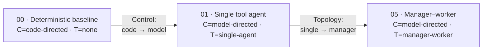

# Agentic FACETS

**A practical framework and code cookbook for classifying agent architectures across
Feedback, Authority, Control, Execution, Topology, and State.**

[](LICENSE)
[](pyproject.toml)

---

## The terminology problem

Agentic systems get described with a flat pile of terms — *planner–executor*, *multi-agent*,
*handoff*, *reflection*, *RAG*, *human-in-the-loop*. But these words don't belong to one
taxonomy. They describe **different dimensions** of a system, and a real system is usually
several of them at once. "Is it single-agent or multi-agent?" is the wrong first question.

## The six axes

Classify any agentic system by six **independent** dimensions:

| | Axis | Core question |
|---|---|---|
| **F** | Feedback | How does it know whether it succeeded? |
| **A** | Authority | What may it do on its own? |
| **C** | Control | Who chooses the next step? |
| **E** | Execution | How does work progress? |
| **T** | Topology | How are the decision-makers organized? |
| **S** | State | What persists, and where is the source of truth? |

> **Agentic architecture is fundamentally about allocating decision rights** — which decisions
> belong to deterministic code, which to a model, which to specialist agents, which require
> environmental proof, and which stay with a human.

## One problem, built several ways

The cookbook is **pattern-first**. It takes a single realistic problem — *a production data
pipeline has failed; investigate it and recommend a fix* — and implements it repeatedly,
**changing one FACETS axis at a time**. That isolation is the teaching device.



## Three architectures in FACETS terms

**Coding agent**
`F=compiler+tests · A=bounded file writes · C=model-directed · E=planner-executor ·
T=single-agent · S=repo + task state`

**Deep-research system**
`F=source comparison · A=read-only · C=model-directed · E=plan/fan-out/aggregate ·
T=manager + parallel workers · S=durable artifacts`

**Customer-support router**
`F=customer + human · A=drafting · C=mostly code-directed · E=routed · T=router + specialists ·
S=session`

A system can be RAG-based, multi-agent, planner–executor, approval-gated, and durable *at the
same time* — because those describe different axes.

## Quick start

```bash
uv sync

# Run the same incident three ways — offline, deterministic, no API key needed:
uv run python recipes/00_deterministic_baseline/app.py
uv run python recipes/01_single_tool_agent/app.py
uv run python recipes/05_manager_worker/app.py

# Compare them side by side:
uv run python evals/run_evals.py
```

```text
        Agentic FACETS — same incident, compared across architectures
┏━━━━━━━━━━━━━━━━━━━━━━━━━━━┳━━━━━━━━━┳━━━━━━━━━━━━━┳━━━━━━━┳━━━━━━━━┳━━━━━━━┓
┃ Recipe                    ┃ Task    ┃ Tool        ┃ Model ┃ Total  ┃       ┃
┃                           ┃ success ┃ correctness ┃ calls ┃ tokens ┃ Steps ┃
┡━━━━━━━━━━━━━━━━━━━━━━━━━━━╇━━━━━━━━━╇━━━━━━━━━━━━━╇━━━━━━━╇━━━━━━━━╇━━━━━━━┩
│ 00_deterministic_baseline │    1.00 │        1.00 │     0 │      0 │     0 │
│ 01_single_tool_agent      │    1.00 │        1.00 │     5 │   1502 │     5 │
│ 05_manager_worker         │    1.00 │        1.00 │    13 │   1946 │     5 │
└───────────────────────────┴─────────┴─────────────┴───────┴────────┴───────┘
```

All three solve the incident. Cost escalates with complexity. **That's the lesson:** use the
simplest architecture that clears your reliability bar.

### Running against a real model

Everything above runs offline via a deterministic `FakeModel`. To drive the agents with a real
model, point them at a **Databricks foundation-model endpoint** (OpenAI-compatible serving
surface) and add `--live`:

```bash
cp .env.example .env    # set DATABRICKS_HOST, DATABRICKS_TOKEN, FACETS_MODEL
uv run python recipes/01_single_tool_agent/app.py --live
```

## What's in the box

```text
src/facets/     Framework-neutral runtime: Agent loop, Tool/ModelProvider protocols,
                FakeModel + DatabricksModel, TaskState, ApprovalPolicy, Trace, Evaluator,
                and the typed FACETS manifest loader.
tools/          The incident scenario — deterministic fake tools over a seeded fixture.
recipes/        Self-contained, runnable recipes (00, 01, 05), one FACETS axis apart.
evals/          The comparative evaluation harness.
docs/           The MkDocs site (the teaching experience).
schema/         JSON Schema for facets.yaml.
```

Each recipe ships a `README.md`, a schema-validated `facets.yaml`, a Mermaid `diagram.mmd`, a
runnable `app.py`, and an `eval.yaml`.

## Documentation

The docs site is the teaching experience; this repo is where you run, inspect, and contribute.

```bash
uv sync --extra docs
uv run mkdocs serve      # http://127.0.0.1:8000
```

Start with **The FACETS Framework** and **Choosing a Pattern**.

## Design principle

Autonomy and extra agents are **earned, not assumed**:

```text
Single LLM call → Deterministic workflow → Single tool-using agent → Multi-agent system
```

Only move down a rung when the one above genuinely can't do the job.

## Status

**Release 0.1** — the framework, the runtime primitives, Recipes 00/01/05, the comparative
evaluation, and the docs site. The rest of the recipe ladder (routing, planner–executor,
parallel investigation, handoffs, maker–checker, durable execution, approval-gated actions, and
a composed production system) and the deeper Databricks production track are on the roadmap. See
[`docs/recipes/index.md`](docs/recipes/index.md#roadmap).

## License

[Apache 2.0](LICENSE).
