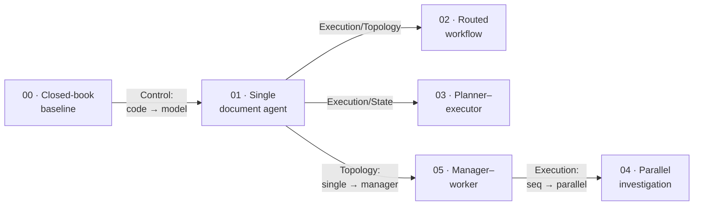

# Agentic FACETS

A code cookbook for agent architectures. We take one hard question, answer it six different ways,
change exactly one design decision each time, and measure what each change buys. That's the whole
idea.

[](LICENSE)
[](pyproject.toml)

---

## The problem

Here's a real question from the [OfficeQA benchmark](https://github.com/databricks/officeqa), which
grades models on hard questions grounded in U.S. Treasury Bulletins:

> As of the January 1980 ownership survey, how many investor-type categories held more than
> \$200 million?

The true answer is **2**. It lives in a table inside a specific 1980 Treasury Bulletin — you find
the ownership-survey table, read the seven category rows, and count the ones over the threshold.

We're going to answer this exact question several times. The first attempt uses no tools at all —
on purpose. By the end you'll know when that's the right call and when it isn't.

## Start with the dumbest possible thing

Whenever I'm tempted to reach for an "agent," I like to first ask what the dumbest version looks
like. Here it's: just ask the model the question. No documents, no tools, no magic. One call.

```bash
uv sync
cp .env.example .env    # fill in DATABRICKS_TOKEN + HF_TOKEN (see "Running it" below)
uv run python recipes/00_closed_book_baseline/app.py
```

```text
Q (UID0121): …how many investor-type categories held more than $200 million…?
Ground truth: 2
Answer:  <FINAL_ANSWER>6</FINAL_ANSWER>
Score:   INCORRECT  (extracted '6' vs truth '2')
Trace:   model_calls=1
```

Wrong. And that's not a bug — it's the honest result, and it's the whole reason the rest of the
repo exists. No model has a 1980 Treasury Bulletin ownership table memorized, so asked cold, it
produces a confident, plausible, wrong number. That single limitation is exactly what the next
version fixes. Nothing more.

## Change one thing: let the model read the documents

Now give the *same question* to a single agent, plus four tools — list the source documents,
search one, read a slice of one, and a calculator — and let the model decide which to call, in
what order, and when it has enough to answer. We changed exactly one decision: who's driving.

```bash
uv run python recipes/01_single_tool_agent/app.py
```

```text
Answer:  …only 2 categories held more than $200 million. <FINAL_ANSWER>2</FINAL_ANSWER>
Score:   CORRECT  (extracted '2' vs truth '2')
Trace:   model_calls=5, tool_calls=[list_source_documents, search_document, read_document, compute, compute]
```

Correct. Stare at the trace for a second. The baseline made 1 model call and guessed; this made
5, and actually *read the table* — it searched the document for the ownership survey, read the
rows, used the calculator to check each category against the \$200M threshold, and counted. What
we bought is grounding. What we paid is calls, tokens, latency, and a real chance the model reads
the wrong row.

That's the entire repo in two runs: **an architecture is a set of decisions, and every decision
has a price you can read off a trace.** "Who chooses the next step?" was just the first one. There
are five more.

## The six decisions: FACETS

Once you start naming these decisions, it turns out six of them cover almost every agent system
you'll meet. The nice part: they're independent. You can change one and leave the other five
alone — which is exactly what the recipes do.

| | Axis | The decision |
|---|---|---|
| **F** | Feedback | How does it know whether it succeeded? |
| **A** | Authority | What may it do on its own, without a human? |
| **C** | Control | Who chooses the next step — code, or the model? |
| **E** | Execution | How does work progress — sequential, parallel, planned? |
| **T** | Topology | One agent, or several, and who's in charge? |
| **S** | State | What persists, and where does truth actually live? |

Going from the baseline to the single agent moved exactly **one** axis: Control, from
code-directed to model-directed (and it dragged Feedback and document access along). Every recipe
plays the same game — change one axis from the recipe before it. Keep five fixed, wiggle one, and
any difference in the results is on that one change. No confounds.



## The evidence: is the architecture as important as the model?

That's the question worth settling with data, and it needs a **grid** — the same questions run
through every architecture *and* several models, so you can compare two levers. Change the
architecture (hold the model fixed); change the model (hold the architecture fixed); see which
moves accuracy more. The harness sweeps a model axis and scores every cell with OfficeQA's own
reward function:

```bash
uv run python evals/run_evals.py \
  --models system.ai.claude-haiku-4-5,system.ai.claude-sonnet-5,system.ai.claude-opus-5 --out
```

Here's a committed run — three Claude models (a weak→strong capability ladder) × six architectures
× the shared question set. Accuracy is over successfully-scored runs; the full artifact, with
cost and per-question detail, is in [`evals/results/latest.md`](evals/results/latest.md):

| Recipe | `haiku-4-5` | `sonnet-5` | `opus-5` |
|---|---|---|---|
| 00 · Closed-book baseline | 0.20 | 0.30 | 0.20 |
| 01 · Single document agent | **0.50** | 0.40 | **0.70** |
| 02 · Routed workflow | 0.30 | 0.30 | 0.50 |
| 03 · Planner–executor | 0.20 | 0.30 | 0.50 |
| 04 · Parallel investigation | 0.20 | 0.20 | 0.60 |
| 05 · Manager–worker | 0.30 | 0.60 | **0.80** |

Every cell is 10 questions (5 for the two-document parallel recipe) — the full grid, no dropped
cells. Read it both ways, because the answer is in the shape of the grid:

- **Closed-book, every model is bad — and about equally bad** (0.20–0.30). No model has an obscure
  Treasury Bulletin table memorized, so *the model alone is a weak lever*: upgrading haiku→opus
  with no architecture buys almost nothing.
- **Architecture is the bigger lever, and it compounds with the model.** Give a fixed model its
  best architecture and accuracy climbs far more than a model upgrade ever did: haiku **+0.30**,
  sonnet **+0.30**, opus **+0.60** — from 0.20 closed-book to **0.80** with manager–worker. The two
  levers *multiply*; the best cells need a capable model **and** a real architecture.
- **The thesis, in one comparison:** on the shared questions, **haiku with the single-document
  agent (0.50) beats sonnet answering closed-book (0.30)**. The smaller model, wired well, doesn't
  just catch the bigger model that isn't — it overtakes it.
- **But architecture only helps a model capable enough to drive it.** The same manager–worker
  topology is 0.30 for haiku and 0.80 for opus. (In the pilot, a genuinely weak open model scored
  **0.00** *with* tools — below some capability floor, machinery makes things worse.) Machinery
  isn't magic; it's leverage, and leverage needs something to push on.

And the caveat that keeps this honest — **cost is the counterweight.** opus + manager–worker's 0.80
costs ~**313k tokens/question**, roughly 320× the closed-book baseline; opus + planner–executor
reaches 0.50 at **20k tokens**, 1/15th the price. So both things are true at once: a better
architecture genuinely lifts accuracy, *and* the fanciest one is rarely worth its price. Pick the
cheapest architecture that clears your reliability bar, match it to a model strong enough to use
it, and make every fancier recipe earn the tokens. Do not be a hero.

> These are real model runs on hard questions at small `n` (10 lookup questions, 5 multi-document).
> Exact numbers shift between runs — the **pattern** is the durable lesson, not any single cell.

## Is this cheating? (No — and here's exactly what's real)

Fair question, because a lot of "agent" demos quietly fake the hard part. Here nothing is faked:

- **The data is real.** 697 actual Treasury Bulletin PDFs (1939–2025), parsed to text. The agent
  reads the real tables.
- **The model is real.** Every recipe calls a real model (Databricks, via the Unity AI Gateway).
  There is no scripted/offline fake path — a wrong answer is a real wrong answer.
- **The grading is real.** Answers are scored by OfficeQA's own `reward.py`, vendored unchanged.

The one simplification, and I want to be upfront about it: **oracle retrieval.** Each question
ships the exact documents that contain its answer, and we hand those to the agent. That's
deliberate — this cookbook teaches agent *architecture*, so we isolate it from the separate
retrieval problem. A production system would add a real search-the-whole-corpus tool. That's a
Feedback/Execution concern, and it doesn't change any recipe's topology.

## Running it

Everything calls a real model over real (gated) data, so you need two credentials. The model is
authenticated with **OAuth by default** (tokens refresh automatically, so a long eval sweep can't
die mid-run) — a static token is a CI-only fallback:

```bash
# 1. Log in to your workspace via OAuth (opens a browser):
databricks auth login --host https://<workspace>.cloud.databricks.com --profile my-workspace

# 2. Point .env at that profile + your Hugging Face token:
cp .env.example .env
# DATABRICKS_CONFIG_PROFILE → my-workspace   (OAuth; DATABRICKS_TOKEN stays blank)
# DATABRICKS_HOST           → your workspace URL
# FACETS_MODEL              → e.g. system.ai.claude-sonnet-5
# HF_TOKEN                  → a Hugging Face token with access to the gated
#                             databricks/officeqa dataset (accept its terms first)

uv run python recipes/01_single_tool_agent/app.py --uid UID0056
```

The recipe code doesn't change based on which model you point at — the `ModelProvider` behind it
does. That seam is the point, and it's what lets the eval harness sweep several models at once
(`--models A,B,C`) to build the grid above.

## What's in the repo

```text
src/facets/           The runtime, framework-neutral: the Agent loop, the Tool and ModelProvider
                      protocols (FakeModel for unit tests, DatabricksModel for real runs),
                      TaskState, ApprovalPolicy, Trace, Evaluator, the typed FACETS manifest.
src/facets/officeqa/  The scenario: the OfficeQA dataset client, the document tools, and the
                      official reward.py wired up as a FACETS scorer.
recipes/              Six runnable recipes (00–05). Each changes one FACETS axis from the last.
evals/                The comparison harness that produced the table above.
docs/                 The MkDocs site.
schema/               The JSON Schema for facets.yaml.
```

Every recipe carries a `README.md`, a schema-validated `facets.yaml` (its architecture written
down as data), a Mermaid `diagram.mmd`, a runnable `app.py`, and an `eval.yaml`.

## Toy code vs. production

The recipes are deliberately the smallest version that still runs the real algorithm. A
production system keeps the same architecture but adds the plumbing a tutorial skips. It's worth
separating two kinds of "adds," because they're not the same thing:

- **Same behavior, better numbers:** batching, caching, concurrent model calls, a faster provider.
  Algorithmically identical, dramatically more efficient.
- **Different guarantees:** real retrieval over the full corpus; durable task state that survives a
  crash (recipe 03 makes the plan an explicit artifact — step one toward this); authority enforced
  in *code* so a prompt can't approve its own dangerous action; retries, idempotency, audit trails,
  real tracing. These change what the system *promises*, not just how fast it is.

What ships today is the mechanism, not the hardening.

## The mental model to keep

- An agent architecture is **six independent decisions** (FACETS), not a single label like
  "multi-agent."
- Hold five fixed, change one, and the effect shows up in the trace. Measurable, every time.
- The simplest architecture that clears your reliability bar is usually the right one. Autonomy
  and extra agents have to earn their keep.

```text
Single LLM call → Single tool-using agent → Workflow (router/planner) → Multi-agent system
```

Move one step to the right only when the step to its left genuinely isn't enough. That's it.

## Where to go next

Read [`docs/facets-framework.md`](docs/facets-framework.md) for the six axes in full, then open
whichever recipe changes the axis you care about — routing, planning, parallelism, or delegation.
To read the docs as a site:

```bash
uv sync --extra docs
uv run mkdocs serve      # http://127.0.0.1:8000
```

## Status

The framework, the runtime, the OfficeQA scenario, Recipes 00–05, the comparison harness, and the
docs. Still on the roadmap: handoffs, maker–checker, durable execution, approval-gated actions, a
composed production system, and a deeper Databricks/MLflow track. See
[`docs/recipes/index.md`](docs/recipes/index.md#roadmap).

## Credits & license

This repo is [Apache 2.0](LICENSE). It builds on the
[OfficeQA benchmark](https://github.com/databricks/officeqa) by Databricks: `reward.py` is
vendored under Apache-2.0 (see [NOTICE](NOTICE)), and the dataset (CC-BY-SA-4.0) is downloaded at
runtime, not redistributed here.
