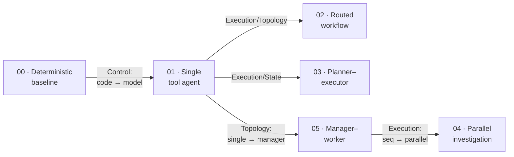

# Agentic FACETS

A code cookbook for agent architectures. We take one broken system, fix it six different ways,
change exactly one design decision each time, and measure what each change costs. That's the
whole idea.

[](LICENSE)
[](pyproject.toml)

---

## The problem

A production data pipeline, `orders_daily`, just failed. Yesterday it wrote 1.25M rows. Today it
wrote 0. We have logs, metrics, a deployment history, and data-quality checks. Find the root
cause.

We're going to solve this exact incident several times. The first solution uses no model at all
— on purpose. By the end you'll know when that's the right call and when it isn't.

## Start with no agent at all

Whenever I'm tempted to reach for an "agent," I like to first ask what the dumbest possible
version looks like. Here it's: call the tools in a fixed order, print what you find. No model, no
agent, no magic — just code.

```bash
uv sync
uv run python recipes/00_deterministic_baseline/app.py
```

```text
Pipeline 'orders_daily' status: FAILED.
Rows written: 0 (baseline 1250000).
First error: SchemaValidationError: column 'amount' expected DECIMAL(18,2) but received STRING.
Failed data-quality columns: amount.
Most recent deployment: deploy-8842 on orders_ingest — Change `amount` field type from DECIMAL to STRING.
Likely cause: a schema mismatch on the 'amount' column, consistent with the recent deployment.
```

That's the correct answer, at zero model calls and basically zero latency. Not bad for a dumb
baseline! And it works for an honest reason: *we* wrote the investigation. Check status, read the
error log, run the data-quality checks, look at recent deploys. The `if` that prints "likely
cause" is a rule a developer typed by hand.

So why would you ever add a model? Point this same code at a failure nobody wrote a rule for —
say a network timeout with clean data-quality checks — and it quietly falls back to dumping raw
facts with no conclusion. It literally cannot investigate a case it wasn't programmed for. That
one limitation is the thing the next version fixes. Nothing more.

## Change one thing: let the model choose the next step

Now hand the *same tools* to a single agent, and let the model decide which tool to call, in what
order, and when it has seen enough to stop. We changed exactly one decision — who picks the next
step — and left everything else alone.

```bash
uv run python recipes/01_single_tool_agent/app.py
```

```text
Root cause: a schema mismatch on the `amount` column. Upstream deployment deploy-8842 changed
`amount` from DECIMAL to STRING, so orders_daily failed schema validation and wrote 0 rows.
Recommend rolling back deploy-8842 (do not simply restart the job — the upstream schema is still wrong).

Trace: model_calls=5, total_tokens=1502, steps=5
       tool_calls=[get_pipeline_status, query_logs, check_data_quality, list_recent_deployments]
```

Same correct answer. But stare at the trace for a second. The baseline cost 0 model calls; this
cost 5, and about 1500 tokens. What we bought for that price is adaptability — the model picked
its own path through the tools and could handle a failure we never anticipated. What we paid is
calls, tokens, latency, and a small but real chance the model reaches for the wrong tool.

And that's the entire repo in two runs: **an architecture is a set of decisions, and every
decision has a price tag you can read off a trace.** "Who chooses the next step?" was just the
first decision. There are five more.

## The six decisions: FACETS

Once you start naming these decisions, it turns out six of them cover almost every agent system
you'll meet. The nice part: they're independent. You can change one and leave the other five
untouched — which is exactly what the recipes do.

| | Axis | The decision |
|---|---|---|
| **F** | Feedback | How does it know whether it succeeded? |
| **A** | Authority | What may it do on its own, without a human? |
| **C** | Control | Who chooses the next step — code, or the model? |
| **E** | Execution | How does work progress — sequential, parallel, planned? |
| **T** | Topology | One agent, or several, and who's in charge? |
| **S** | State | What persists, and where does truth actually live? |

Going from the baseline to the single agent moved exactly **one** axis: Control, from
code-directed to model-directed. Every recipe in the ladder plays the same game — change one axis
from the recipe before it. Keep five fixed, wiggle one, and any difference in the results table
is on that one change. No confounds.



## The evidence: same incident, six architectures

Run every recipe against the same failure and score them side by side:

```bash
uv run python evals/run_evals.py
```

```text
        Agentic FACETS — same incident, compared across architectures
┏━━━━━━━━━━━━━━━━━━━━━━━━━━━┳━━━━━━━━━┳━━━━━━━━━━━━━┳━━━━━━━┳━━━━━━━━┳━━━━━━━┓
┃ Recipe                    ┃ Task    ┃ Tool        ┃ Model ┃ Total  ┃       ┃
┃                           ┃ success ┃ correctness ┃ calls ┃ tokens ┃ Steps ┃
┡━━━━━━━━━━━━━━━━━━━━━━━━━━━╇━━━━━━━━━╇━━━━━━━━━━━━━╇━━━━━━━╇━━━━━━━━╇━━━━━━━┩
│ 00_deterministic_baseline │    1.00 │        1.00 │     0 │      0 │     0 │
│ 01_single_tool_agent      │    1.00 │        1.00 │     5 │   1502 │     5 │
│ 02_routed_workflow        │    1.00 │        1.00 │     5 │   1217 │     4 │
│ 03_planner_executor       │    1.00 │        1.00 │     4 │   1914 │     4 │
│ 04_parallel_investigation │    1.00 │        1.00 │     9 │   1064 │     5 │
│ 05_manager_worker         │    1.00 │        1.00 │    13 │   1946 │     5 │
└───────────────────────────┴─────────┴─────────────┴───────┴────────┴───────┘
```

Read this slowly, because it's easy to misread. **Every architecture solved the incident.** The
manager–worker system did not solve it *better* than the single agent — it spent 13 model calls
instead of 5 to arrive at the same conclusion. On this problem, the extra agents were pure
overhead. Beautiful diagram, more machinery, identical answer.

One honest caveat, because I can't emphasize this enough: these numbers come from deterministic
offline runs. That makes them stable and reproducible, but not identical to what a live model
does. The *ordering* is the signal, not the absolute counts. And model-call count is not a
quality score — the planner–executor looks cheap here only because its scripted plan happens to
converge fast, and parallel investigation trades tokens for wall-clock latency, which a
deterministic run can't even show you.

The durable lesson: **more machinery is not more capability.** Pick the simplest architecture
that's reliable enough for your problem, and make every fancier recipe earn its price tag. Do not
be a hero.

## Run it against a real model

Everything above runs offline against a deterministic `FakeModel`, so the whole repo works with
no API key and gives the same output every single time. That's the teaching implementation — a
sanity check you can trust. To drive the same agents with a real model, point them at a
**Databricks foundation-model endpoint** (it speaks the OpenAI-compatible API) and add `--live`:

```bash
cp .env.example .env    # set DATABRICKS_HOST, DATABRICKS_TOKEN, FACETS_MODEL
uv run python recipes/01_single_tool_agent/app.py --live
```

The agent code doesn't change one line between offline and live. Only the `ModelProvider` behind
it does. That swap is the entire reason the seam exists.

## What's in the repo

```text
src/facets/     The runtime, framework-neutral: the Agent loop, the Tool and ModelProvider
                protocols, FakeModel and DatabricksModel, TaskState, ApprovalPolicy, Trace,
                Evaluator, and the typed FACETS manifest loader. The lego blocks.
tools/          The incident scenario: deterministic tools over one seeded fixture, so every
                recipe investigates the identical failure.
recipes/        Six runnable recipes (00–05). Each changes one FACETS axis from the last.
evals/          The comparison harness that printed the table above.
docs/           The MkDocs site.
schema/         The JSON Schema for facets.yaml.
```

Every recipe carries a `README.md`, a schema-validated `facets.yaml` (its architecture written
down as data), a Mermaid `diagram.mmd`, a runnable `app.py`, and an `eval.yaml`.

## Toy code vs. production

The recipes are deliberately the smallest version that still runs the real algorithm. A
production system keeps the same architecture but adds the plumbing a tutorial skips. It's worth
separating two kinds of "adds," because they are not the same thing:

- **Same behavior, better numbers:** batching, caching, parallel model calls, a faster provider.
  Algorithmically identical, dramatically more efficient.
- **Different guarantees:** durable task state that survives a crash (recipe 03 makes the plan an
  explicit artifact, which is step one toward this), authority enforced in *code* so a prompt
  can't approve its own dangerous action, retries and idempotency, audit trails, real tracing.
  These change what the system promises, not just how fast it is.

Where a later recipe adds one of these, it says so. What ships today is the mechanism, not the
hardening.

## The mental model to keep

- An agent architecture is **six independent decisions** (FACETS), not a single label like
  "multi-agent."
- Hold five fixed, change one, and the effect shows up in the trace. Measurable, every time.
- The simplest architecture that clears your reliability bar is usually the right one. Autonomy
  and extra agents have to earn their keep.

```text
Single LLM call → Deterministic workflow → Single tool-using agent → Multi-agent system
```

Move one step to the right only when the step to its left genuinely isn't enough. That's it.

## Where to go next

Read [`docs/facets-framework.md`](docs/facets-framework.md) for the six axes in full, then open
whichever recipe changes the axis you actually care about — routing, planning, parallelism, or
delegation. To read the docs as a site:

```bash
uv sync --extra docs
uv run mkdocs serve      # http://127.0.0.1:8000
```

## Status

Release 0.1: the framework, the runtime, Recipes 00–05, the comparison harness, and the docs.
Still on the roadmap: handoffs, maker–checker, durable execution, approval-gated actions, a
composed production system, and a deeper Databricks track. See
[`docs/recipes/index.md`](docs/recipes/index.md#roadmap).

## License

[Apache 2.0](LICENSE).
