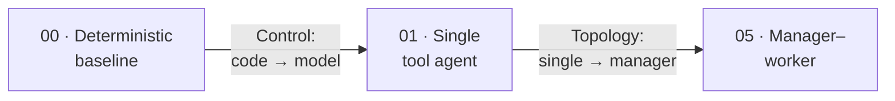

# Agentic FACETS

**A practical framework and code cookbook for classifying agent architectures.**

Agentic systems get described with a flat pile of terms — *planner–executor*, *multi-agent*,
*handoff*, *reflection*, *RAG*, *human-in-the-loop*. The trouble is these words don't belong to
one taxonomy. They describe **different dimensions** of a system, and a single system is usually
several of them at once.

FACETS gives those dimensions names. Classify any agentic system by six independent axes:

| | Axis | Core question |
|---|---|---|
| **F** | Feedback | How does it know whether it succeeded? |
| **A** | Authority | What may it do on its own? |
| **C** | Control | Who chooses the next step? |
| **E** | Execution | How does work progress? |
| **T** | Topology | How are the decision-makers organized? |
| **S** | State | What persists, and where is the source of truth? |

> **Agentic architecture is fundamentally about allocating decision rights** — which decisions
> belong to deterministic code, which to a model, which to specialist agents, which require
> environmental proof, and which stay with a human.

## The cookbook is pattern-first

We take **one realistic problem** — *a production data pipeline has failed; investigate it and
recommend a fix* — and build it several ways, **changing one FACETS axis at a time**. That
isolation is the teaching device: when only Control changes from Recipe 00 to Recipe 01, any
difference in the results table is attributable to giving the model the wheel.



Every runnable system carries a machine-readable [`facets.yaml`](facets-framework.md#the-facets-manifest)
profile, and the [evaluation harness](evaluation.md) reports the same metrics across all of
them so the tradeoffs are visible, not asserted.

## Quick start

```bash
uv sync

# Run the same incident three ways (offline, deterministic — no API key needed):
uv run python recipes/00_deterministic_baseline/app.py
uv run python recipes/01_single_tool_agent/app.py
uv run python recipes/05_manager_worker/app.py

# Compare them side by side:
uv run python evals/run_evals.py
```

To drive the agents with a real model, point them at a Databricks foundation-model endpoint
(see [`.env.example`](https://github.com/jtaylorisbell/agentic-facets/blob/main/.env.example))
and add `--live`.

## Design principle

Autonomy and extra agents are **earned, not assumed**:

```text
Single LLM call
    ↓ only when insufficient
Deterministic workflow
    ↓ only when runtime decisions are necessary
Single tool-using agent
    ↓ only when context or specialization requires it
Multi-agent system
```

Use the simplest architecture that solves the problem reliably. Start with
[The FACETS Framework](facets-framework.md).
