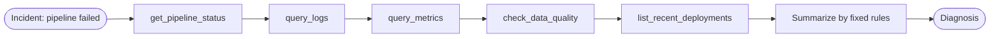

# Recipe 00 · Deterministic Baseline

> **FACETS:** `F=open-loop · A=advisory · C=code-directed · E=sequential · T=none · S=request-local`

The non-agentic control. Before reaching for a model, see how far plain code goes — autonomy is
*earned*, not assumed.



The **Control** axis is `code-directed`: the graph above is fixed. The tools are the same
read-only tools the agent recipes use, but *code* — not a model — decides the order and writes
the summary.

## Run it

```bash
uv run python recipes/00_deterministic_baseline/app.py
```

## What it teaches

- A deterministic baseline is cheap, fast, auditable, and — when the failure modes are known —
  entirely sufficient. It sets the bar every agent recipe must justify beating.
- Its weakness: it can only diagnose failures the developer anticipated. Point it at a novel
  failure and it degrades to reporting raw facts with no cause. That gap motivates
  [Recipe 01](01-single-tool-agent.md).

## Source

Full walkthrough, failure lab, and "when (not) to use it" in the recipe README:
[`recipes/00_deterministic_baseline/`](https://github.com/jtaylorisbell/agentic-facets/tree/main/recipes/00_deterministic_baseline).
