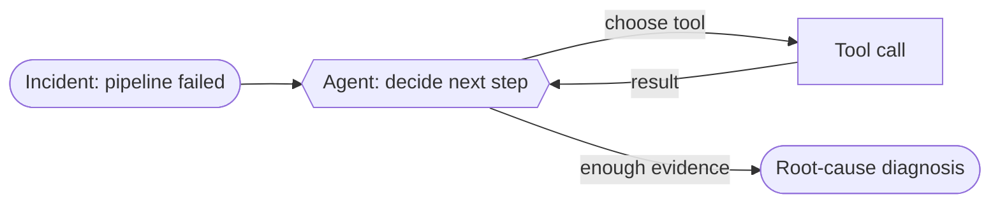

# Recipe 01 · Single Tool Agent

> **FACETS:** `F=closed-loop · A=advisory · C=model-directed · E=planner-executor · T=single-agent · S=request-local`

Same problem as [Recipe 00](00-deterministic-baseline.md), **one axis changed**:

```diff
 Control:
-  code-directed      # developer writes the graph
+  model-directed     # the model chooses the next tool and when to stop
```

Flipping Control drags Feedback (now closed-loop) and Execution (now planner–executor) along
with it. Topology, Authority, and State are unchanged — still a single, read-only, request-local
investigator. That isolation lets you attribute any change in the results table to *giving the
model the wheel*.



## Run it

```bash
uv run python recipes/01_single_tool_agent/app.py          # offline (scripted FakeModel)
uv run python recipes/01_single_tool_agent/app.py --live   # live Databricks endpoint
```

Offline uses a deterministic scripted plan; `--live` drives the *same* agent with a real
Databricks foundation model that chooses its own tools.

## What it teaches

- **Tool descriptions matter** — they're how the model chooses.
- **`max_steps` is a Control boundary** — the difference between a *bounded* tool-using agent and
  an *open-ended* one. A confused model degrades to a truncated answer instead of looping.
- **One agent is often enough.** Don't add agents until one demonstrably can't do it.

## The cost of adaptability

Versus Recipe 00: same task success, but **more model calls, more tokens, higher latency**. The
lesson isn't "agents are better" — it's *exactly what model-directed control buys and costs*. See
[Evaluation](../evaluation.md).

## Source

[`recipes/01_single_tool_agent/`](https://github.com/jtaylorisbell/agentic-facets/tree/main/recipes/01_single_tool_agent).
