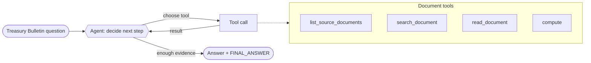

# Recipe 01 · Single document agent

> **FACETS:** `F=closed-loop · A=advisory · C=model-directed · E=planner-executor · T=single-agent · S=request-local`

Same OfficeQA question as [Recipe 00](00-closed-book-baseline.md) — but now we give the model a
way to *read the documents*. The answer lives in a table inside a long Treasury Bulletin; the
agent has to find it, read it, and often compute with it.

## What changed?

```diff
 Control:
-  code-directed      # one fixed model call, answer from memory
+  model-directed     # the model chooses which tool to call and when to answer

 Feedback:
-  open-loop
+  closed-loop        # read a tool result -> decide again

 + document tools     # list / search / read / compute over the real corpus
```

Exactly one axis changed — **Control** — and flipping it drags **Feedback** (now closed-loop) and
**Execution** (now planner–executor) along with it. On top of that, the agent gains read-only
**document tools** scoped to the question's source documents. Topology, Authority, and State are
unchanged: still a single, advisory, request-local investigator. The model now drives its own
investigation and decides the path itself, bounded by `max_steps`.



## Run it

```bash
uv run python recipes/01_single_tool_agent/app.py            # default question (UID0121)
uv run python recipes/01_single_tool_agent/app.py --uid UID0056
```

This runs a **real Databricks model** over the **real corpus** and scores the answer with the
official OfficeQA `reward.py`. There is no offline/fake path — a wrong answer is a real wrong
answer.

## Oracle retrieval

Each OfficeQA question ships the gold `source_files` that contain its answer, and the tools are
*scoped to those documents*. That is deliberate: this cookbook teaches agent architecture, so we
hand the agent the right documents and let the architecture differences show up in how it reasons
over them — not in whether it can solve the separate retrieval problem.

## What it teaches

- **Document access is what turns a confident guess into a grounded answer.** Versus Recipe 00,
  expect much higher correctness — because the agent can actually read the source.
- **Model-directed control has a cost:** many more model calls and tokens for that adaptability.
- **`max_steps` is a Control boundary.** A hard multi-hop question can exhaust it and truncate;
  the result is marked `stopped_reason="max_steps"` and scored 0.
- **One agent is often enough** — don't add topology until one demonstrably can't do it. When the
  work splits into sub-domains or needs parallelism, see [Recipe 05](05-manager-worker.md).

See [Evaluation](../evaluation.md) for the head-to-head against Recipe 00.

## Source

[`recipes/01_single_tool_agent/`](https://github.com/jtaylorisbell/agentic-facets/tree/main/recipes/01_single_tool_agent)
