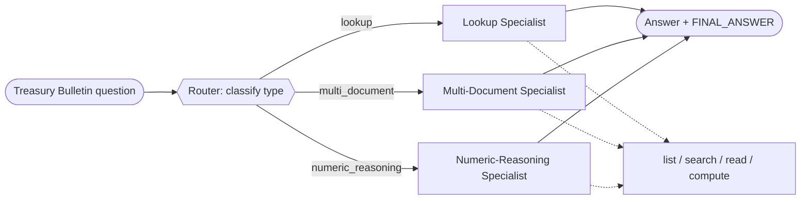

# Recipe 02 · Routed workflow

> **FACETS:** `F=closed-loop · A=advisory · C=code-directed · E=router · T=router-specialists · S=request-local`

The same OfficeQA questions as [Recipe 01](01-single-tool-agent.md) — but now we recognize they
fall into **types**: a direct lookup, a multi-document comparison, or a numeric-reasoning question.
A classifier (one model call) picks the type; then **code** dispatches to the specialist tuned for
it. The specialists share the same document tools, but each has a prompt and step budget for its
question type.

## What changed?

```diff
 Execution:
-  planner-executor   # one agent loops over all tools
+  router             # classify, then branch to a specialist

 Topology:
-  single-agent
+  router-specialists

 Control:
-  model-directed     # the model drove the whole investigation
+  code-directed      # a model classifies, but CODE dispatches the branch
```

The classification is model-assisted, but the branch (`if lookup: run the lookup specialist`) is
developer-written. That's the tell that a router is usually still a **workflow**, not a full
multi-agent system.



## Router vs. manager vs. handoff

This is the recipe where the three get disentangled:

| | Who picks the specialist? | Who stays responsible? |
|---|---|---|
| **Router** (this recipe) | **Code**, from a fixed menu, after a classification | The workflow |
| **Manager–worker** ([05](05-manager-worker.md)) | A **model** decomposes and delegates | The manager |
| **Handoff** (06, later) | The current agent decides to transfer | The **new** specialist |

## Run it

```bash
uv run python recipes/02_routed_workflow/app.py
uv run python recipes/02_routed_workflow/app.py --uid UID0056
```

## What it teaches

- **Misrouting is the characteristic failure.** Classify a numeric-reasoning question as `lookup`
  and the lookup specialist — with its tight step budget and "just read the value" prompt — is
  likely to answer without doing the arithmetic. The classifier and the specialists must be
  designed together.
- **The classification is model-assisted, but the branch is code.** One model call maps the
  question to a category; a developer-written `if` dispatches to the specialist.
- **A router is usually still a workflow**, not a full multi-agent system — code owns the control
  flow, and only *one* specialist runs.

## Source

[`recipes/02_routed_workflow/`](https://github.com/jtaylorisbell/agentic-facets/tree/main/recipes/02_routed_workflow)
