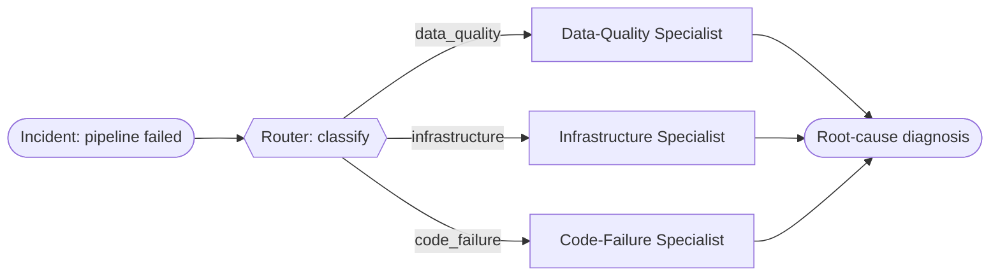

# Recipe 02 · Routed Workflow

> **FACETS:** `F=closed-loop · A=advisory · C=code-directed · E=router · T=router-specialists · S=request-local`

Incidents fall into **categories**, each best handled by a specialist. A classifier (one model
call) picks the category; then **code** dispatches to the predefined specialist for that domain.

```diff
 Execution:
-  planner-executor   # one agent loops over all tools   (Recipe 01)
+  router             # classify, then branch to a specialist

 Topology:
-  single-agent
+  router-specialists

 Control:
-  model-directed
+  code-directed      # a model classifies, but CODE dispatches the branch
```



## Router vs. manager vs. handoff

This is the recipe where the three get disentangled:

| | Who picks the specialist? | Who stays responsible? |
|---|---|---|
| **Router** (here) | **Code**, from a fixed menu, after a classification | The workflow |
| **Manager–worker** ([05](05-manager-worker.md)) | A **model** decomposes and delegates | The manager |
| **Handoff** (06, later) | The current agent decides to transfer | The **new** specialist |

The tell: the classification is model-assisted, but the branching (`if data_quality: …`) is
developer-written. A router is usually still a **workflow**, not a full multi-agent system.

## Run it

```bash
uv run python recipes/02_routed_workflow/app.py          # offline (scripted)
uv run python recipes/02_routed_workflow/app.py --live   # live Databricks endpoint
```

## What it teaches

- **Misrouting is the characteristic failure.** Route to the infra specialist and it lacks the
  data-quality and deployment tools to find the real cause — so the classifier and the specialist
  toolsets must be designed together.
- Cheaper than manager–worker because only *one* specialist runs.

## Source

[`recipes/02_routed_workflow/`](https://github.com/jtaylorisbell/agentic-facets/tree/main/recipes/02_routed_workflow).
