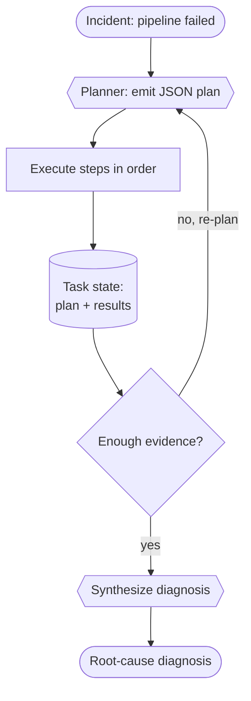

# Recipe 03 · Planner–Executor

> **FACETS:** `F=closed-loop · A=advisory · C=model-directed · E=planner-executor · T=single-agent · S=durable-task`

Make the **plan an explicit artifact**: a planner emits a structured list of steps up front, code
executes them, then the planner inspects the results and re-plans if the evidence is
insufficient.

```diff
 Execution:
-  reactive tool loop   # next tool chosen implicitly, one step at a time   (Recipe 01)
+  plan-then-execute    # a structured plan is emitted, executed, then revised

 State:
-  message history      # the "plan" lives implicitly in the conversation
+  explicit task plan   # TaskState.plan — a first-class, persisted, inspectable artifact
```



## Run it

```bash
uv run python recipes/03_planner_executor/app.py          # offline (scripted)
uv run python recipes/03_planner_executor/app.py --live   # live Databricks endpoint
```

## What it teaches

- **The plan is durable and inspectable.** Recipe 01 already had a planner–executor *shape*
  implicitly; here the plan is a first-class `TaskState.plan` with checkpoints around each step —
  the precondition for durable, resumable execution ([Recipe 08](index.md#roadmap), later).
- **Avoid over-planning.** The planner is prompted to request only the steps it still needs; the
  re-plan loop gathers evidence incrementally rather than front-loading every tool.
- **Degrade gracefully.** Malformed plan JSON is tolerated (falls back to "done"); a bounded
  re-plan count prevents non-termination.

## Source

[`recipes/03_planner_executor/`](https://github.com/jtaylorisbell/agentic-facets/tree/main/recipes/03_planner_executor).
