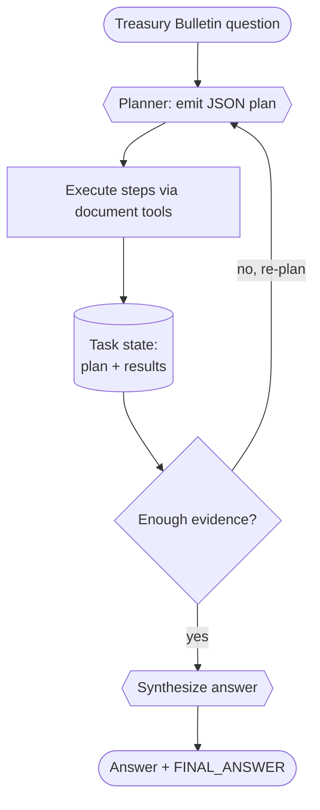

# Recipe 03 · Planner–executor

> **FACETS:** `F=closed-loop · A=advisory · C=model-directed · E=planner-executor · T=single-agent · S=durable-task`

Same OfficeQA question as [Recipe 01](01-single-tool-agent.md) — but this time we make the **plan
an explicit artifact**. The system decides which documents to read and what to compute up front,
executes those steps, then inspects the results and re-plans if the evidence is insufficient.

## What changed?

```diff
 Execution:
-  reactive tool loop   # next tool chosen implicitly, one step at a time   (Recipe 01)
+  plan-then-execute    # a structured plan is emitted, executed, then revised

 State:
-  message history      # the "plan" lives implicitly in the conversation
+  explicit task plan   # TaskState.plan — a first-class, persisted, inspectable artifact
```



## Run it

```bash
uv run python recipes/03_planner_executor/app.py
uv run python recipes/03_planner_executor/app.py --uid UID0056
```

## What it teaches

- **The plan is a first-class persisted artifact.** Recipe 01 already had a planner–executor
  *shape* implicitly; here the plan is an explicit `TaskState.plan` with checkpoints around each
  step — the precondition for durable, resumable execution.
- **Avoid over-planning.** The planner is prompted to request only the steps it still needs; the
  re-plan loop gathers evidence incrementally rather than front-loading every read.
- **Degrade gracefully.** Malformed plan JSON is tolerated (`_parse_plan` falls back to `done`),
  and a bounded `MAX_REPLANS` count prevents non-termination.

## Source

[`recipes/03_planner_executor/`](https://github.com/jtaylorisbell/agentic-facets/tree/main/recipes/03_planner_executor)
