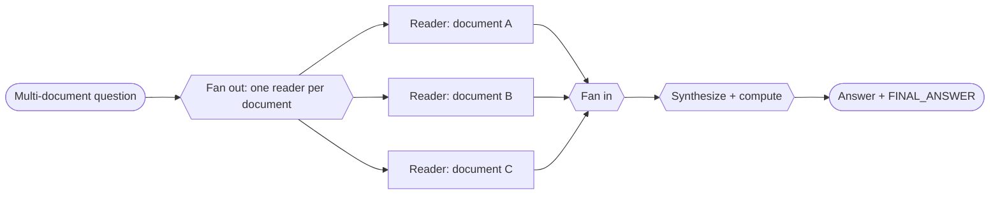

# Recipe 04 · Parallel investigation

> **FACETS:** `F=closed-loop · A=advisory · C=model-directed · E=parallel · T=manager-worker · S=request-local`

Many OfficeQA questions span **multiple documents** — e.g. compare a figure from the 1953
bulletin with the one from 1954. Reading those documents is independent, so read them
concurrently, then combine.

## What changed?

```diff
 Execution:
-  sequential reads        # one agent reads document A, then B, then C
+  parallel fan-out/fan-in # one reader per document runs concurrently, then results are merged
```

A multi-document question gets **one reader per source document**, and those readers run at the
same time. Only **Execution** changes from [manager–worker](05-manager-worker.md): there's still a
coordinator plus workers (Topology), but the workers no longer wait in line.



## Latency vs. token cost

| | Sequential ([05](05-manager-worker.md)) | Parallel (this recipe) |
|---|---|---|
| **Wall-clock latency** | sum of all branches | ≈ the *slowest* branch |
| **Token cost** | N branches | N branches (**unchanged**) |

Parallelism buys **latency, not tokens.** Every branch still runs and still costs its tokens.

## Run it

```bash
# Use a multi-document question so there's something to parallelize:
uv run python recipes/04_parallel_investigation/app.py --uid UID0025
```

Each per-document reader runs in its own `ExecutionContext` and `Trace` (so concurrent spans don't
interleave), launched together with `asyncio.gather`. After the join, the child traces are merged
into the parent with `Trace.absorb`, and a synthesizer combines the findings and does the final
arithmetic.

## What it teaches

- **Single-document questions don't benefit.** With one source file this degrades to one branch
  plus a synthesis — correct, but no faster than [Recipe 01](01-single-tool-agent.md). Parallelism
  only pays when the work actually splits.
- **Isolated context:** readers can't see each other's findings — only the synthesizer does. If two
  documents must be cross-referenced mid-read, they aren't independent.
- **Readers report facts, the synthesizer computes.** If a reader does the arithmetic instead, unit
  mistakes creep in before synthesis can catch them.

## Source

[`recipes/04_parallel_investigation/`](https://github.com/jtaylorisbell/agentic-facets/tree/main/recipes/04_parallel_investigation)
