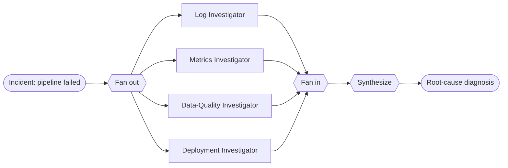

# Recipe 04 · Parallel Investigation

> **FACETS:** `F=closed-loop · A=advisory · C=model-directed · E=parallel · T=manager-worker · S=request-local`

The four lines of investigation don't depend on each other, so run them **concurrently**, then
combine.

```diff
 Execution:
-  sequential delegation   # manager delegates to one worker, waits, then the next   (Recipe 05)
+  parallel fan-out/fan-in # all investigators run concurrently, then results are merged
```

Only **Execution** changes from manager–worker.



## Latency vs. token cost — the core lesson

| | Sequential ([05](05-manager-worker.md)) | Parallel (here) |
|---|---|---|
| **Wall-clock latency** | sum of all branches | ≈ the *slowest* branch |
| **Token cost** | N branches | N branches (**unchanged**) |

Parallelism buys **latency, not tokens.** Every branch still runs and still costs its tokens.

## Run it

```bash
uv run python recipes/04_parallel_investigation/app.py          # offline (scripted)
uv run python recipes/04_parallel_investigation/app.py --live   # live Databricks endpoint
```

Each investigator runs in its own `ExecutionContext` and `Trace` (concurrent spans don't
interleave), launched with `asyncio.gather`; after the join the child traces are merged into the
parent via `Trace.absorb`.

## What it teaches

- **Only parallelize genuinely independent subtasks.** Investigators can't see each other's
  findings — only the synthesizer does. If two branches must share a clue mid-flight, they aren't
  independent.
- **Partial failure** is a real concern: a production version would collect exceptions and
  synthesize from the branches that succeeded.

## Source

[`recipes/04_parallel_investigation/`](https://github.com/jtaylorisbell/agentic-facets/tree/main/recipes/04_parallel_investigation).
