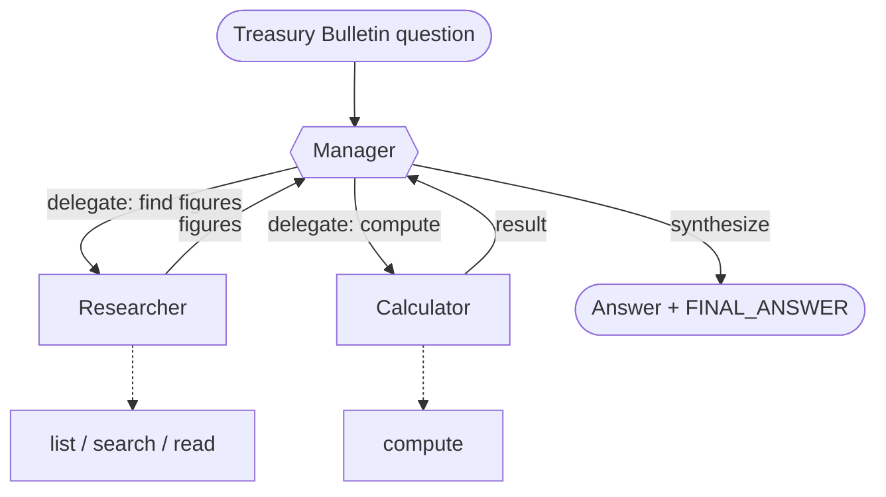

# Recipe 05 · Manager–worker

> **FACETS:** `F=closed-loop · A=advisory · C=model-directed · E=planner-executor · T=manager-worker · S=request-local`

The same OfficeQA question, now split across **specialist agents** coordinated by a manager.

## What changed?

```diff
 Topology:
-  single-agent       # one context holds the whole problem
+  manager-worker     # a manager delegates to specialist workers
```

Only **Topology** changes from [Recipe 01](01-single-tool-agent.md). Control is still
model-directed, Authority still advisory, State still request-local — the cleanest way to ask
*"does adding agents actually help?"* Hold everything else fixed and read the results table.

The two workers have **disjoint toolsets**: a **researcher** that lists, searches, and reads the
Treasury Bulletins (no arithmetic) and a **calculator** that only computes (no document access).
Neither can do the other's job.



Workers are exposed to the manager as **delegate tools** via `facets.agents.agent_as_tool`. Each
worker is an `Agent` with a *disjoint* toolset, running in its own isolated context — it can't see
the manager's conversation or the other worker's.

## Manager–worker vs. handoff

The defining difference is **ownership**:

- **Manager–worker (here):** the manager delegates, the worker returns a result, and the manager
  stays responsible for the final answer. Workers are intelligent *tools*.
- **Handoff (Recipe 06, later):** responsibility *transfers* — the specialist takes over the
  conversation and the original agent steps out.

## Run it

```bash
uv run python recipes/05_manager_worker/app.py
uv run python recipes/05_manager_worker/app.py --uid UID0056
```

One Databricks model drives the manager and both workers; each is a separate `Agent` with its own
scoped tools and context.

## What it teaches

- **Agents as tools with scoped, disjoint capabilities** — the calculator literally cannot touch
  documents, the researcher literally cannot do arithmetic. Delegation contracts do the wiring.
- **More agents ≠ better.** On most single-document questions the single agent (Recipe 01) already
  gets the answer; manager–worker spends *more* model calls and tokens to reach the same place.
  Multi-agent earns its keep when one context genuinely can't hold the problem — not by default.
- **Context isolation cuts both ways.** The calculator never sees the documents, so if the manager
  relays a wrong number, the calculator will faithfully compute the wrong result.

## Source

[`recipes/05_manager_worker/`](https://github.com/jtaylorisbell/agentic-facets/tree/main/recipes/05_manager_worker).
