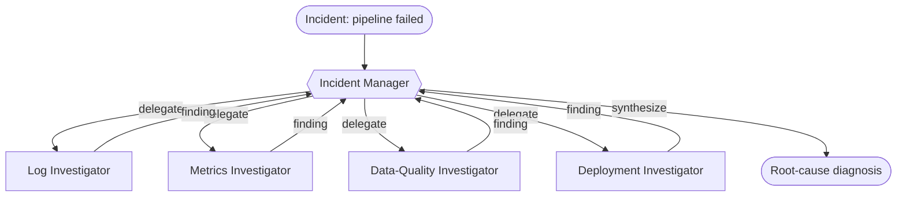

# Recipe 05 · Manager–Worker

> **FACETS:** `F=closed-loop · A=advisory · C=model-directed · E=planner-executor · T=manager-worker · S=request-local`

Same problem as [Recipe 01](01-single-tool-agent.md), **one axis changed**:

```diff
 Topology:
-  single-agent       # one context holds the whole problem
+  manager-worker     # a manager delegates to specialist workers
```

Only Topology changes — the cleanest way to answer *"does adding agents actually help?"* Hold
everything else fixed and read the results table.



Workers are exposed to the manager as **delegate tools** via `facets.agents.agent_as_tool`. Each
worker is an agent with a *scoped* toolset, running in its own isolated context.

## Manager–worker vs. handoff

The defining difference is **ownership**:

- **Manager–worker (here):** the manager delegates, the worker returns a result, the manager
  stays responsible. Workers are intelligent *tools*.
- **Handoff (Recipe 06, later):** responsibility *transfers* — the specialist takes over.

## Run it

```bash
uv run python recipes/05_manager_worker/app.py          # offline (scripted)
uv run python recipes/05_manager_worker/app.py --live   # live Databricks endpoint
```

## What it teaches

- **Agents as tools**, context isolation, and delegation contracts.
- **More agents ≠ better.** On this incident, the single agent already gets the right answer;
  manager–worker spends *more* model calls and tokens to reach the same conclusion. Multi-agent
  earns its keep when one context genuinely can't hold the problem — not by default.
- **Isolation cuts both ways** — a clue only one worker saw won't inform the others unless the
  manager relays it.

## Source

[`recipes/05_manager_worker/`](https://github.com/jtaylorisbell/agentic-facets/tree/main/recipes/05_manager_worker).
