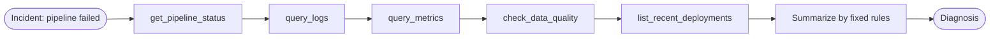

# Recipe 00 — Deterministic baseline

> **FACETS:** `F=open-loop  A=advisory  C=code-directed  E=sequential  T=none  S=request-local`

## Problem

A production data pipeline (`orders_daily`) has failed. Investigate it, inspect logs, metrics,
and data quality, and report the likely root cause.

This recipe establishes the **non-agentic control**. Before reaching for a model or an agent,
see how far plain code goes — the design principle of the framework is that autonomy is
*earned*, not assumed.

## What changed?

Nothing yet — this is the starting point. Everything is decided up front by the developer.

## Architecture



The **Control** axis is `code-directed`: the graph above is fixed. The tools are the same
read-only tools the agent recipes use, but *the code* — not a model — decides the order and
writes the summary.

## Minimal implementation

See [`app.py`](./app.py). The `diagnose()` function calls the raw tool functions in a fixed
sequence and assembles a rule-based summary. There is no `Agent` and no `ModelProvider`.

```bash
uv run python recipes/00_deterministic_baseline/app.py
```

## Walkthrough

1. `get_pipeline_status(orders_daily)` → `FAILED`.
2. `query_logs(level=ERROR)` → `SchemaValidationError … 'amount' expected DECIMAL … received STRING`.
3. `query_metrics` → `rows_written` dropped from 1.25M to 0.
4. `check_data_quality` → the `amount` type check failed.
5. `list_recent_deployments` → `deploy-8842` changed `amount` to STRING.
6. A hard-coded rule stitches these into: *likely a schema mismatch on `amount`.*

## Failure lab

- **Novel failure:** point the fixture at a failure mode the rules don't cover (e.g. a network
  timeout with no DQ failure). The baseline degrades to reporting raw facts with no cause —
  it cannot reason about what it wasn't programmed for. This is the motivation for Recipe 01.
- **Rule brittleness:** the "likely cause" line keys on `amount` appearing in failed columns.
  Change the column name and the conclusion silently disappears.

## Evaluation

`task_success` is 1.0 (the phrase "schema mismatch" appears) and `tool_correctness` is 1.0
(all five tools run) — at **zero model calls and near-zero latency**. That's the baseline's
strength, and the number every agent recipe must justify beating. See
[`eval.yaml`](./eval.yaml) and `evals/run_evals.py`.

## When to use it

- The investigation steps are known, stable, and few.
- Determinism, auditability, and cost matter more than adaptability.

## When *not* to use it

- The failure modes are open-ended and you can't enumerate the branches in advance.
- You need the system to decide *what to look at next* based on what it just found — that's
  [Recipe 01](../01_single_tool_agent/).
