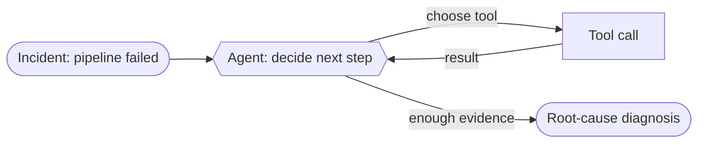

# Recipe 01 — Tool-using single agent

> **FACETS:** `F=closed-loop  A=advisory  C=model-directed  E=planner-executor  T=single-agent  S=request-local`

## Problem

The same failed `orders_daily` pipeline as [Recipe 00](../00_deterministic_baseline/) — but now
the investigation path is *not* known in advance. We want the system to decide what to look at
next based on what it just found.

## What changed?

```diff
 Control:
-  code-directed      # developer writes the graph
+  model-directed     # the model chooses the next tool and when to stop

 Feedback:
-  open-loop
+  closed-loop        # observe tool result -> decide again
```

Exactly **one axis** changes from the baseline (Control), which drags Feedback and Execution
along with it. Topology, Authority, and State are unchanged — still a single, read-only,
request-local investigator. That isolation is the whole point: you can attribute any difference
in the eval table to giving the model the wheel.

## Architecture



## Minimal implementation

See [`app.py`](./app.py). A single `Agent` is constructed with `read_only_tools()`, a system
prompt, and `Budget(max_steps=8)`. The loop lives in `facets.agents.Agent.run` — the recipe
just wires it up.

```bash
uv run python recipes/01_single_tool_agent/app.py          # offline (scripted FakeModel)
uv run python recipes/01_single_tool_agent/app.py --live   # live Databricks endpoint
```

The offline run uses a scripted plan (`scripted_model`) so it is deterministic and free; the
`--live` run drives the *same* agent with a real Databricks foundation model, which chooses its
own tools.

## Walkthrough

The scripted plan mirrors a competent investigation: `get_pipeline_status` → `query_logs(ERROR)`
→ `check_data_quality` → `list_recent_deployments` → conclude. Each tool result is fed back into
the model's context (that's the closed loop), and the model stops calling tools once it can name
the cause.

## Failure lab

- **Tool hallucination:** if the model calls a tool that doesn't exist, `Agent._invoke_tool`
  returns a soft error listing the real tools, and the model can recover (covered in
  `tests/adversarial`).
- **Infinite loop:** a model that never says "done" is stopped by `max_steps`; the result is
  marked `stopped_reason="max_steps"` and scored as a failure (also in `tests/adversarial`).
- **Under-investigation:** lower `max_steps` to 1 and the agent concludes before gathering
  evidence — high confidence, wrong answer. A cautionary tale about too-tight budgets.

## Evaluation

Compared to Recipe 00, expect the **same task success** but **more model calls, more tokens, and
higher latency** — the cost of adaptability. The lesson isn't "agents are better"; it's *"here is
exactly what model-directed control buys and what it costs."* Run `evals/run_evals.py` to see 00
vs 01 side by side.

## When to use it

- The set of failures is open-ended; you can't pre-write every branch.
- One context can hold the whole problem — you don't need specialists (yet).

## When *not* to use it

- The path is fixed and known → [Recipe 00](../00_deterministic_baseline/) is cheaper and safer.
- The problem needs isolated expert contexts or parallelism →
  [Recipe 05](../05_manager_worker/).
