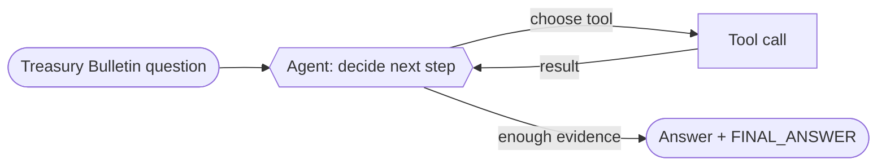

# Recipe 01 — Single document agent

> **FACETS:** `F=closed-loop  A=advisory  C=model-directed  E=planner-executor  T=single-agent  S=request-local`

## Problem

The same OfficeQA question as [Recipe 00](../00_closed_book_baseline/) — but now we give the model
a way to *read the documents*. The answer lives in a table inside a long Treasury Bulletin; the
agent has to find it, read it, and often compute with it.

## What changed?

```diff
 Control:
-  code-directed      # one fixed model call, answer from memory
+  model-directed     # the model chooses which tool to call and when to answer

 Feedback:
-  open-loop
+  closed-loop        # read a tool result -> decide again

 + document tools     # list / search / read / compute over the real corpus
```

The model now drives its own investigation. It gets read-only document tools scoped to the
question's source documents (oracle retrieval — see below) and decides the path itself, bounded
by `max_steps`.

## Architecture



## Minimal implementation

See [`app.py`](./app.py). A single `Agent` gets `build_document_tools(dataset, source_files)`, a
system prompt, and `Budget(max_steps=16)`. The loop lives in `facets.agents.Agent.run`.

```bash
uv run python recipes/01_single_tool_agent/app.py            # default question (UID0121)
uv run python recipes/01_single_tool_agent/app.py --uid UID0056
```

This runs a **real Databricks model** over the **real corpus** and scores the answer with the
official OfficeQA `reward.py`. There is no offline/fake path — a wrong answer is a real wrong
answer.

## Oracle retrieval

Each OfficeQA question ships the gold `source_files` that contain its answer, and the tools are
*scoped to those documents*. That is deliberate: this cookbook teaches agent **architecture**, so
we hand the agent the right documents and let the architecture differences show up in how it
*reasons over* them — not in whether it can solve the separate retrieval problem. A production
system would add a real retrieval tool over the full 697-document corpus.

## Walkthrough

A typical run: `list_source_documents` → `search_document` to find the table → `read_document`
for the exact rows → `compute` for the arithmetic → answer with `<FINAL_ANSWER>…</FINAL_ANSWER>`.
Each tool result feeds back into the model's context — that is the closed loop.

## Failure lab

- **Tool hallucination:** calling a tool that doesn't exist returns a soft error listing the real
  tools, so the model can recover.
- **Wrong table / bad arithmetic:** the model reads the wrong row, or sums the wrong column. This
  is where most real errors live — and why `compute` and the search-with-context exist.
- **Running out of steps:** a hard multi-hop question can exhaust `max_steps` and truncate. The
  result is marked `stopped_reason="max_steps"` and scored 0. Honest, and common on the hardest
  questions.

## Evaluation

Compared to [Recipe 00](../00_closed_book_baseline/), expect **much higher answer correctness** —
because the agent can actually read the source — at the cost of many more model calls and tokens.
That contrast is the lesson: document access is what turns a confident guess into a grounded
answer. Run `evals/run_evals.py`.

## When to use it

- The answer is in documents the model can access, and one context can hold the problem.
- The path isn't known in advance; the model should decide what to read next.

## When *not* to use it

- The model already knows the answer → [Recipe 00](../00_closed_book_baseline/) is far cheaper.
- The work splits into distinct sub-domains or needs parallelism →
  [Recipe 05](../05_manager_worker/) and [Recipe 04](../04_parallel_investigation/).
