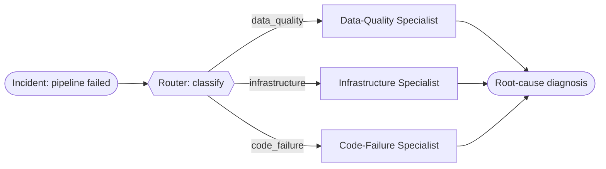

# Recipe 02 — Routed workflow

> **FACETS:** `F=closed-loop  A=advisory  C=code-directed  E=router  T=router-specialists  S=request-local`

## Problem

The same failed `orders_daily` pipeline — but now we recognize that incidents fall into
**categories** (data-quality, infrastructure, code-failure), each best handled by a specialist.
Classify the incident, then hand it to the right specialist.

## What changed?

Relative to [Recipe 01](../01_single_tool_agent/) (single tool agent):

```diff
 Execution:
-  planner-executor   # one agent loops over all tools
+  router             # classify, then branch to a specialist

 Topology:
-  single-agent
+  router-specialists

 Control:
-  model-directed     # the model drove the whole investigation
+  code-directed      # a model classifies, but CODE dispatches the branch
```

The classification step is model-assisted, but the branching logic (`if data_quality: run the
DQ specialist`) is written by the developer. That's the signal that a router is usually still a
**workflow**, not a full multi-agent system.

## Architecture



## Router vs. manager vs. handoff

This is the recipe where those three get disentangled:

| | Who picks the specialist? | Who stays responsible? |
|---|---|---|
| **Router** (this recipe) | **Code**, from a fixed menu, after a classification | The workflow |
| **Manager–worker** ([05](../05_manager_worker/)) | A **model** decomposes and delegates | The manager |
| **Handoff** (06, later) | The current agent decides to transfer | The **new** specialist |

## Minimal implementation

```bash
uv run python recipes/02_routed_workflow/app.py          # offline (scripted)
uv run python recipes/02_routed_workflow/app.py --live   # live Databricks endpoint
```

`classify()` makes one model call and maps the reply to a category; `_specialist()` returns the
predefined agent for that category (each scoped to only the tools its domain needs).

## Walkthrough

1. The router classifies `orders_daily` → `data_quality` (one model call).
2. Code dispatches to the data-quality specialist.
3. The specialist runs `check_data_quality` → `query_logs` → `list_recent_deployments` and
   concludes: schema mismatch on `amount`, traced to `deploy-8842`.

## Failure lab

- **Misroute:** if the classifier picks `infrastructure`, the infra specialist (which only sees
  status + metrics) can report *that* something failed but not *why* — it lacks the DQ and deploy
  tools. Misrouting is the router's characteristic failure, and why the classifier and the
  specialist toolsets must be designed together.
- **Ambiguous classification:** `classify()` falls back to a safe default (`data_quality`) rather
  than crash when the model's reply doesn't name a known category.

## Evaluation

Expect the same task success as Recipes 01/05 with a **model-call count between them** — one
classification call plus a scoped specialist investigation. Cheaper than manager–worker because
only one specialist runs. Run `evals/run_evals.py`.

## When to use it

- Requests fall into a small number of recognizable categories.
- Each category has a genuinely different tool/expertise profile.

## When *not* to use it

- Categories overlap or the boundaries are fuzzy → a single agent ([01](../01_single_tool_agent/))
  avoids brittle routing.
- The model, not code, should decide how to decompose the work → manager–worker
  ([05](../05_manager_worker/)).
