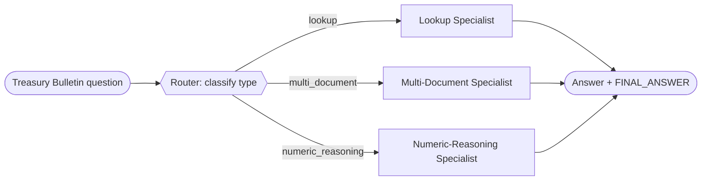

# Recipe 02 — Routed workflow

> **FACETS:** `F=closed-loop  A=advisory  C=code-directed  E=router  T=router-specialists  S=request-local`

## Problem

The same OfficeQA questions — but now we recognize they fall into **types**: a direct lookup, a
multi-document comparison, or a numeric-reasoning question. Each is best handled a bit
differently. Classify the question, then hand it to the right specialist.

## What changed?

Relative to [Recipe 01](../01_single_tool_agent/):

```diff
 Execution:
-  planner-executor   # one agent loops over all tools
+  router             # classify, then branch to a specialist

 Topology:
-  single-agent
+  router-specialists

 Control:
-  model-directed     # the model drove the whole investigation
+  code-directed      # a model classifies, but CODE dispatches the branch
```

The classification is model-assisted, but the branch (`if lookup: run the lookup specialist`) is
written by the developer. That's the signal that a router is usually still a **workflow**, not a
full multi-agent system.

## Architecture



The specialists share the same document tools, but each has a prompt and step budget tuned to its
question type (the lookup specialist expects a couple of calls; the numeric one is told to always
use `compute`).

## Router vs. manager vs. handoff

This is the recipe where the three get disentangled:

| | Who picks the specialist? | Who stays responsible? |
|---|---|---|
| **Router** (this recipe) | **Code**, from a fixed menu, after a classification | The workflow |
| **Manager–worker** ([05](../05_manager_worker/)) | A **model** decomposes and delegates | The manager |
| **Handoff** (06, later) | The current agent decides to transfer | The **new** specialist |

## Minimal implementation

```bash
uv run python recipes/02_routed_workflow/app.py
uv run python recipes/02_routed_workflow/app.py --uid UID0056
```

`classify()` makes one model call and maps the reply to a category; `build_specialist()` returns
the agent tuned for that category.

## Walkthrough

1. The router classifies the question → e.g. `numeric_reasoning` (one model call).
2. Code dispatches to the numeric-reasoning specialist, which is told to always use `compute`.
3. The specialist reads the table, computes, and answers.

## Failure lab

- **Misroute:** classify a numeric-reasoning question as `lookup` and the lookup specialist —
  with its tight step budget and "just read the value" prompt — is likely to answer without doing
  the arithmetic. Misrouting is the router's characteristic failure, and why the classifier and
  the specialists must be designed together.
- **Ambiguous classification:** `classify()` falls back to a safe default (`lookup`) rather than
  crash when the model's reply doesn't name a known category.

## Evaluation

Similar correctness to the single agent, with **one extra model call** for the classification.
The router doesn't automatically do *better* here — the win is that each specialist can be tuned
to its question type. Run `evals/run_evals.py`.

## When to use it

- Requests fall into a few recognizable types that benefit from different handling.
- You want a cheap, inspectable branch rather than a model deciding the decomposition.

## When *not* to use it

- The types overlap or the boundary is fuzzy → a single agent
  ([01](../01_single_tool_agent/)) avoids brittle routing.
- The model, not code, should decide how to decompose → manager–worker
  ([05](../05_manager_worker/)).
