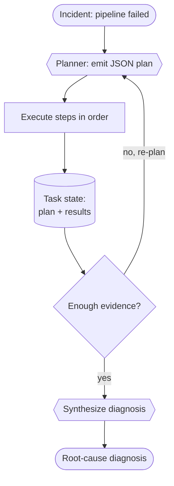

# Recipe 03 — Planner–executor

> **FACETS:** `F=closed-loop  A=advisory  C=model-directed  E=planner-executor  T=single-agent  S=durable-task`

## Problem

The same failed `orders_daily` pipeline. This time we make the **plan an explicit artifact** —
the system decides the investigation steps up front, executes them, then inspects the results
and re-plans if the evidence is insufficient.

## What changed?

Relative to [Recipe 01](../01_single_tool_agent/) (single tool agent):

```diff
 Execution:
-  reactive tool loop   # next tool chosen implicitly, one step at a time
+  plan-then-execute    # a structured plan is emitted, executed, then revised

 State:
-  message history      # the "plan" lives implicitly in the conversation
+  explicit task plan   # TaskState.plan — a first-class, persisted, inspectable artifact
```

Recipe 01 already used a planner–executor *shape* implicitly. The point of this recipe is to make
the plan **explicit and durable**: a structured list of steps you can inspect, checkpoint, and
resume — the foundation for durable execution ([Recipe 08](../), later).

## Architecture



## Minimal implementation

```bash
uv run python recipes/03_planner_executor/app.py          # offline (scripted)
uv run python recipes/03_planner_executor/app.py --live   # live Databricks endpoint
```

- **Planner** (`_plan`): a model call that returns JSON — `{"steps": [...], "done": bool}` — given
  the goal and the results gathered so far.
- **Executor** (`_execute_step`): *code* dispatches each planned step to its tool and records the
  result on `TaskState`.
- The loop re-plans until the planner says `done` (bounded by `MAX_REPLANS`).

## Walkthrough

1. **Plan:** the planner requests status + error logs + data-quality checks.
2. **Execute:** each step runs; results are persisted to `TaskState.plan` and `artifacts`, with
   checkpoints recorded around every step.
3. **Inspect / re-plan:** the planner sees it can't yet attribute the schema change and adds a
   `list_recent_deployments` step.
4. **Done → synthesize:** with the deployment identified, the planner returns `done`, and a final
   synthesis call writes the diagnosis.

## Failure lab

- **Over-planning:** a planner that front-loads every tool "just in case" wastes calls. The
  prompt explicitly discourages this ("request only the steps you still need"), and the re-plan
  loop rewards gathering incrementally.
- **Malformed plan JSON:** `_parse_plan` tolerates prose and code fences and degrades to
  `done=true` rather than crashing.
- **Non-termination:** `MAX_REPLANS` bounds the loop; exhausting it yields
  `stopped_reason="max_replans"`. A planner that returns no steps but isn't done stops with
  `no_progress`.

## Evaluation

Similar task success to the other agent recipes, with model calls split between **planning,
per-step execution, and a final synthesis**. The payoff isn't fewer tokens — it's a plan you can
inspect and resume. Run `evals/run_evals.py`.

## When to use it

- The path can't be fully known in advance, but you want the reasoning about *what to do* made
  explicit and separable from *doing it*.
- You need resumability — a durable plan is the precondition for
  [durable execution](../).

## When *not* to use it

- The investigation is short and the implicit loop of [Recipe 01](../01_single_tool_agent/) is
  enough — an explicit plan adds ceremony you may not need.
