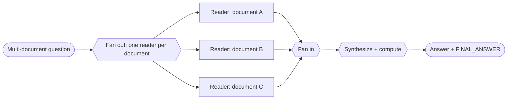

# Recipe 04 — Parallel investigation

> **FACETS:** `F=closed-loop  A=advisory  C=model-directed  E=parallel  T=manager-worker  S=request-local`

## Problem

Many OfficeQA questions span **multiple documents** — e.g. "compare the figure from the 1953
bulletin with the one from 1954." Reading those documents is independent, so there's no reason to
read them one at a time. Read them concurrently, then combine.

## What changed?

Relative to [Recipe 01](../01_single_tool_agent/) / [Recipe 05](../05_manager_worker/):

```diff
 Execution:
-  sequential reads        # one agent reads document A, then B, then C
+  parallel fan-out/fan-in # one reader per document runs concurrently, then results are merged
```

Only **Execution** changes. There's still a coordinator plus workers (Topology), but the workers
run at the same time.

## Architecture



## Minimal implementation

```bash
# Use a multi-document question so there's something to parallelize:
uv run python recipes/04_parallel_investigation/app.py --uid UID0025
```

Each per-document reader runs in its **own `ExecutionContext` with its own `Trace`** (so
concurrent spans don't interleave), launched together with `asyncio.gather`. After the join, the
child traces are merged into the parent with `Trace.absorb`, and a synthesizer combines the
findings and does the final arithmetic.

## Latency vs. token cost

This is the recipe's core lesson:

| | Sequential ([05](../05_manager_worker/)) | Parallel (this recipe) |
|---|---|---|
| **Wall-clock latency** | sum of all branches | ≈ the *slowest* branch |
| **Token cost** | N branches | N branches (**unchanged**) |

Parallelism buys **latency, not tokens.** Every branch still runs and still costs its tokens.

## Walkthrough

1. **Fan out:** one reader per source document launches concurrently, each scoped to just its
   document and told to report raw figures (not compute the answer).
2. **Fan in:** each returns its findings; their traces merge into the parent, so model-call and
   token totals still roll up correctly.
3. **Synthesize:** one final call combines the per-document figures and does the arithmetic.

## Failure lab

- **Single-document questions don't benefit.** With one source file this degrades to one branch
  plus a synthesis — correct, but no faster than Recipe 01. Parallelism only pays when the work
  actually splits.
- **Isolated context:** readers can't see each other's findings — only the synthesizer does. If
  two documents must be cross-referenced mid-read, they aren't independent.
- **Split responsibility for arithmetic:** readers report facts, the synthesizer computes. If a
  reader computes instead, unit mistakes creep in before synthesis can catch them.

## Evaluation

Similar correctness to the other agent recipes on multi-document questions, at a similar token
cost but lower wall-clock latency under a real model. Run `evals/run_evals.py`.

## When to use it

- The question splits into independent per-document (or per-section) reads, and latency matters.

## When *not* to use it

- Single-document or tightly-coupled questions → [Recipe 01](../01_single_tool_agent/) or
  [planner–executor](../03_planner_executor/).
