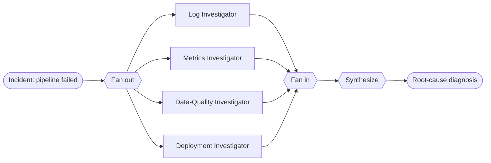

# Recipe 04 — Parallel investigation

> **FACETS:** `F=closed-loop  A=advisory  C=model-directed  E=parallel  T=manager-worker  S=request-local`

## Problem

The same failed `orders_daily` pipeline. The four lines of investigation — logs, metrics, data
quality, deployments — **don't depend on each other**, so there's no reason to run them one at a
time. Run them concurrently, then combine.

## What changed?

Relative to [Recipe 05](../05_manager_worker/) (manager–worker):

```diff
 Execution:
-  sequential delegation   # manager delegates to one worker, waits, delegates to the next
+  parallel fan-out/fan-in # all investigators run concurrently, then results are merged
```

Only **Execution** changes. Topology is still manager-worker in spirit (a coordinator plus
workers); the workers just run at the same time.

## Architecture



## Minimal implementation

```bash
uv run python recipes/04_parallel_investigation/app.py          # offline (scripted)
uv run python recipes/04_parallel_investigation/app.py --live   # live Databricks endpoint
```

Each investigator runs in its **own `ExecutionContext` with its own `Trace`** (so concurrent
spans don't interleave under a shared object), launched together with `asyncio.gather`. After the
join, the child traces are merged into the parent with `Trace.absorb`, and a synthesizer combines
the findings.

## Latency vs. token cost

This is the recipe's core lesson:

| | Sequential (Recipe 05) | Parallel (this recipe) |
|---|---|---|
| **Wall-clock latency** | sum of all branches | ≈ the *slowest* branch |
| **Token cost** | N branches | N branches (**unchanged**) |

Parallelism buys latency, not tokens. Every branch still runs and still costs its tokens — you're
trading concurrency for speed, not for efficiency.

## Walkthrough

1. **Fan out:** four investigators launch concurrently, each scoped to one tool.
2. **Fan in:** each returns a terse finding; their traces merge into the parent (so model-call
   and token totals still roll up correctly).
3. **Synthesize:** one final call combines the four findings → schema mismatch on `amount`,
   traced to `deploy-8842`.

## Failure lab

- **Isolated context:** investigators can't see each other's findings — only the synthesizer
  does. If two branches need to share a clue mid-flight, they're *not* independent and shouldn't
  be parallelized this way.
- **Partial failure:** if one branch errors, `asyncio.gather` would propagate it. A production
  version would use `return_exceptions=True` and synthesize from the branches that succeeded —
  a natural extension exercise.
- **False independence:** parallelizing dependent subtasks produces a confident synthesis built
  on incomplete reasoning.

## Evaluation

Same task success as Recipes 01/03/05, at a **similar token cost to manager–worker** but lower
wall-clock latency under a real model. Run `evals/run_evals.py`.

## When to use it

- Subtasks are genuinely independent and latency matters.
- Each branch is expensive enough that concurrency is worth the coordination.

## When *not* to use it

- Subtasks depend on each other's results → sequential or
  [planner–executor](../03_planner_executor/).
- One agent already answers it cheaply → [Recipe 01](../01_single_tool_agent/).
