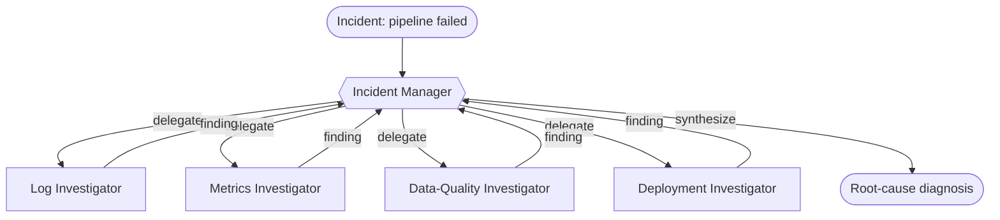

# Recipe 05 — Manager–worker

> **FACETS:** `F=closed-loop  A=advisory  C=model-directed  E=planner-executor  T=manager-worker  S=request-local`

## Problem

The same failed `orders_daily` pipeline. Now we split the investigation across **specialist
agents** — one each for logs, metrics, data quality, and deployments — coordinated by a manager.

## What changed?

```diff
 Topology:
-  single-agent       # one context holds the whole problem
+  manager-worker     # a manager delegates to specialist workers
```

Only **Topology** changes from [Recipe 01](../01_single_tool_agent/). Control is still
model-directed, Authority still advisory, State still request-local. This is the cleanest way to
answer the question *"does adding agents actually help?"* — hold everything else fixed and look
at the eval table.

## Architecture



Workers are exposed to the manager as **delegate tools** via
`facets.agents.agent_as_tool`. Each worker is an `Agent` with a *scoped* toolset (see
[`agents.py`](./agents.py)) and runs in its own isolated context — it can't see the manager's
conversation or the other workers'.

## Manager–worker vs. handoff

The defining difference is **ownership**:

- **Manager–worker (this recipe):** the manager delegates, the worker returns a result, and the
  manager stays responsible for the final answer. Workers are intelligent *tools*.
- **Handoff ([Recipe 06](../), later):** responsibility *transfers* — the specialist takes over
  the conversation and the original agent steps out.

## Minimal implementation

```bash
uv run python recipes/05_manager_worker/app.py          # offline (scripted)
uv run python recipes/05_manager_worker/app.py --live   # live Databricks endpoint
```

Offline, the manager and each worker have their own deterministic `FakeModel` script, so the
whole delegation tree is reproducible. Live, one Databricks model drives the manager and all
workers.

## Walkthrough

1. The manager delegates four subtasks (one per specialist).
2. Each worker calls its scoped tool(s) in its own context and returns a terse finding.
3. Findings roll back up into the manager's context; their token cost rolls up into the shared
   trace.
4. The manager synthesizes: schema mismatch on `amount`, traced to `deploy-8842`.

## Failure lab

- **Bad delegation:** the manager sends a vague `task` and the worker can't act usefully. Fix by
  tightening the delegate-tool descriptions and the instructions the manager passes.
- **More agents ≠ better:** on this incident, the single agent (Recipe 01) already gets the right
  answer. The manager–worker version spends **more model calls and tokens** to reach the same
  conclusion — the eval makes that cost visible. Multi-agent earns its keep when one context
  genuinely can't hold the problem (context limits, deep per-domain expertise, parallelism), not
  by default.
- **Context isolation cuts both ways:** workers can't see each other, so a clue only the log
  worker saw won't inform the metrics worker unless the manager relays it.

## Evaluation

Expect the **same task success** as Recipe 01 at **higher model-call count and token cost**. That
contrast — "we built the same agent two ways; here's what topology changed" — is the point.
Run `evals/run_evals.py` for the 00 vs 01 vs 05 table.

## When to use it

- The problem has genuinely distinct sub-domains that benefit from isolated context or expertise.
- You want to parallelize independent investigations (see Recipe 04, later).

## When *not* to use it

- One agent already solves it reliably → [Recipe 01](../01_single_tool_agent/). Don't pay for
  coordination you don't need.
