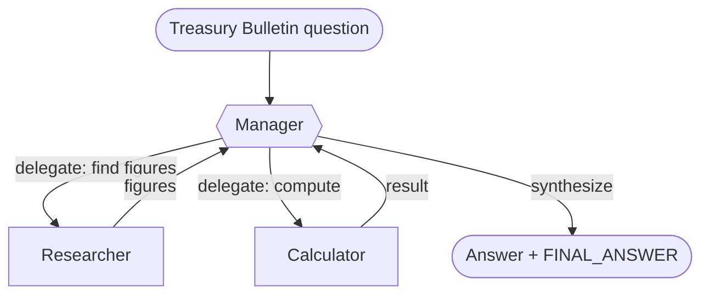

# Recipe 05 — Manager–worker

> **FACETS:** `F=closed-loop  A=advisory  C=model-directed  E=planner-executor  T=manager-worker  S=request-local`

## Problem

The same OfficeQA question. Now we split the work across **specialist agents** — a researcher
that reads documents and a calculator that does arithmetic — coordinated by a manager.

## What changed?

```diff
 Topology:
-  single-agent       # one context holds the whole problem
+  manager-worker     # a manager delegates to specialist workers
```

Only **Topology** changes from [Recipe 01](../01_single_tool_agent/). Control is still
model-directed, Authority still advisory, State still request-local. This is the cleanest way to
ask *"does adding agents actually help?"* — hold everything else fixed and look at the eval table.

## Architecture



Workers are exposed to the manager as **delegate tools** via `facets.agents.agent_as_tool`. Each
worker is an `Agent` with a *disjoint* toolset (see [`agents.py`](./agents.py)): the researcher
can read but not compute, the calculator can compute but not read. Each runs in its own isolated
context — it can't see the manager's conversation or the other worker's.

## Manager–worker vs. handoff

The defining difference is **ownership**:

- **Manager–worker (this recipe):** the manager delegates, the worker returns a result, and the
  manager stays responsible for the final answer. Workers are intelligent *tools*.
- **Handoff ([Recipe 06](../), later):** responsibility *transfers* — the specialist takes over
  the conversation and the original agent steps out.

## Minimal implementation

```bash
uv run python recipes/05_manager_worker/app.py
uv run python recipes/05_manager_worker/app.py --uid UID0056
```

One Databricks model drives the manager and both workers; each is a separate `Agent` with its
own scoped tools and context.

## Walkthrough

1. The manager asks the **researcher** for the specific figures the question needs.
2. The researcher searches and reads the documents, and reports the raw numbers (no arithmetic).
3. If the question needs math, the manager hands those numbers to the **calculator**.
4. Findings and results roll back up into the manager's context (and the shared trace); the
   manager synthesizes the final answer.

## Failure lab

- **Bad delegation:** a vague instruction to the researcher yields vague figures. Tightening the
  delegate-tool descriptions and the manager's prompt is the fix.
- **More agents ≠ better:** on most single-document questions, the single agent (Recipe 01)
  already gets the answer. Manager–worker spends **more model calls and tokens** to reach the same
  place — the eval makes that visible. Multi-agent earns its keep when one context genuinely
  can't hold the problem (context limits, deep specialization), not by default.
- **Context isolation cuts both ways:** the calculator never sees the documents, so if the
  manager relays a wrong number, the calculator will faithfully compute the wrong result.

## Evaluation

Expect **similar correctness** to Recipe 01 at **higher model-call count and token cost** — the
overhead of coordination. That contrast is the point. Run `evals/run_evals.py`.

## When to use it

- The work has genuinely distinct sub-tasks that benefit from isolated context or a minimal,
  safe toolset per worker (a calculator that literally cannot touch documents).

## When *not* to use it

- One agent already solves it reliably → [Recipe 01](../01_single_tool_agent/). Don't pay for
  coordination you don't need.
